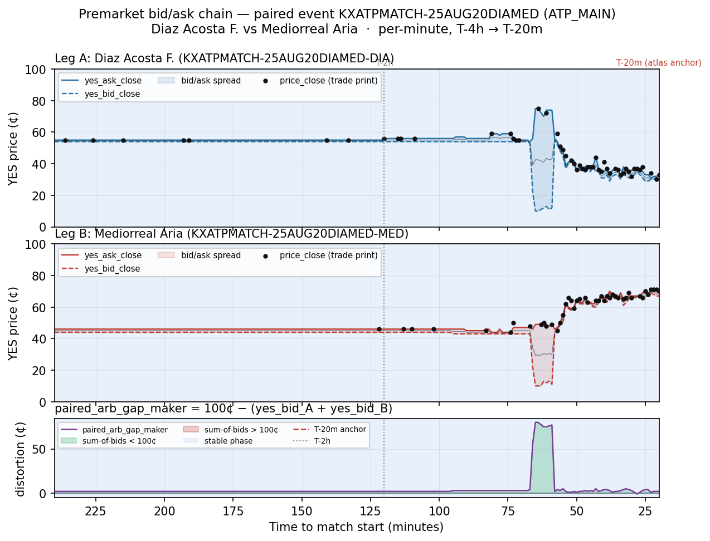

# Example premarket bid/ask chain & paired distortion — one illustrative event

**Date:** 2026-05-22
**Track:** premarket_dynamics_v1 (microstructure-only premarket descriptive corpus)
**Event:** `KXATPMATCH-25AUG20DIAMED` · **Category:** ATP_MAIN
**Leg A:** `KXATPMATCH-25AUG20DIAMED-DIA` — Diaz Acosta F.
**Leg B:** `KXATPMATCH-25AUG20DIAMED-MED` — Mediorreal Aria

Single worked example: one paired event, both legs, full premarket window (T-4h → T-20m),
bid/ask trajectory plus the paired-distortion overlay. Grounds intuition before any
corpus-wide query. **Descriptive only — no strategy claim, no FV anchor join.**

## Sources (read-only)

| Artifact | sha256 | role |
|----------|--------|------|
| `data/durable/per_minute_universe/premarket_tape_v1.parquet` | `ff2a63d9951d1a3d6b80044106c96ca9fdfd8d3951590e73eec1b46209c5a214` | per-(ticker,minute) premarket tape — all plotted series |
| `data/durable/spike_volatility_map/atp_main_spike_perN.parquet` | `621c86340b90653e384720b1f10c4617f9fbd64d5f177cbfab0d2153c9ea960f` | atlas ticker list for the qualification inner-join |

Producer state at extraction: `HEAD == 30a47b6afcee87c95682b566ef6e10ed037a178a`.
Player names resolved from `tennis.db` (`players.name`, keyed by the 3-char kalshi_code suffix).
Prices in the tape are stored on a 0–1 scale; the chart and this note express them in cents
(×100), the Kalshi native unit.

## Selection methodology (deterministic, not curated)

1. Restrict to **ATP_MAIN** tickers that are **atlas-qualified** — present in
   `atp_main_spike_perN.parquet` (inner join on the ticker list; 4,137 atlas tickers).
2. Group atlas tickers to events (`event_ticker = ticker.rsplit('-',1)[0]`); keep only events
   with **exactly 2 distinct atlas legs** (both sides anchored at T-20m) → 1,907 paired events.
3. Require **full ~220-minute window coverage on both legs** (≥200 of the ~221 possible minutes,
   window spanning T-240m down to T-20m) → 292 qualifying events.
4. Among qualifiers, take the **median** of total `volume_in_minute` summed across both legs
   (lower-median of 292; alphabetical `event_ticker` tiebreak).

**Selected:** `KXATPMATCH-25AUG20DIAMED`, total premarket volume **47,970** contracts
(DIA 29,105 / MED 18,865), 220 and 221 covered minutes respectively. A deliberately *typical*
event by liquidity — neither a thin edge case nor a blowout headline market.

## Observations (descriptive)

For roughly the first two and a half hours the book is **quiet and tightly two-sided**, and it
barely trades. At T-4h DIA quotes 54¢/55¢ and MED 44¢/46¢ (1–2¢ spreads), and at T-2h the quotes
are essentially unchanged (DIA 54¢/56¢, MED 44¢/46¢). Across this stretch the two YES-bids sum to
≈98¢, so the distortion overlay sits flat near **+2¢** — the normal small two-sided gap — and the
trade-print scatter is nearly empty: the book just sits at a fair, balanced quote with Diaz Acosta
the marginal favorite.

The structure is all in the **back ~70 minutes**, where a sharp repricing **flips the favorite**.
Volume arrives in a burst (DIA's busiest minute is 10,168 contracts at T-43m; trade prints cluster
densely from ~T-70m onward, 51/44 minutes with prints over the whole window), and DIA's mid
collapses from ~55¢ toward ~32¢ while MED's rises from ~45¢ to ~68¢ — a near-perfect mirror image,
so the two legs are **visibly coupled**, not drifting independently. During the move the books go
briefly **one-sided**: DIA's spread blows out to 65¢ around T-60m (bid 11¢ / ask 74¢), and the
distortion overlay spikes to **+80¢ at T-65m**, i.e. the two resting bids momentarily summed to
only ~20¢ as liquidity was pulled on one side mid-repricing. By the **T-20m atlas anchor** the book
has fully re-converged to a tight two-sided state (DIA 31¢/33¢, MED 67¢/69¢) and the distortion is
back to **+2¢** — the same near-zero level it held before the move. Only 1 of 220 minutes shows a
negative gap (bid-sum > 100¢, a momentary cross, at T-28m, −1¢). For this event the paired
distortion is essentially a **transient of the repricing** — large mid-window, near-zero at the
anchor the atlas measures from.

*This is n=1, chosen for typical liquidity to illustrate what the per-minute series look like.
No inference about other events is drawn; the operator will interpret, and the corpus-wide
queries (e.g. spread compression by category) come next.*

## Chart

Three stacked panels share a reversed time axis (T-4h = 240 on the left → T-20m = 20 on the right).
Top two panels are each leg's YES bid/ask close (cents) with the spread shaded, `mid_close` as a
faint guide, and black markers at each minute that printed a trade (`price_close`). The bottom
panel is the paired distortion `paired_arb_gap_maker = 100¢ − (yes_bid_A + yes_bid_B)`, green
where the bid-sum is under 100¢ and red where it crosses over. Dashed red line = T-20m atlas
anchor; dotted grey line = T-2h. The whole window for this event carries the `stable`
premarket-phase label (light-blue shading); no `formation` minutes fall inside T-4h→T-20m here.
