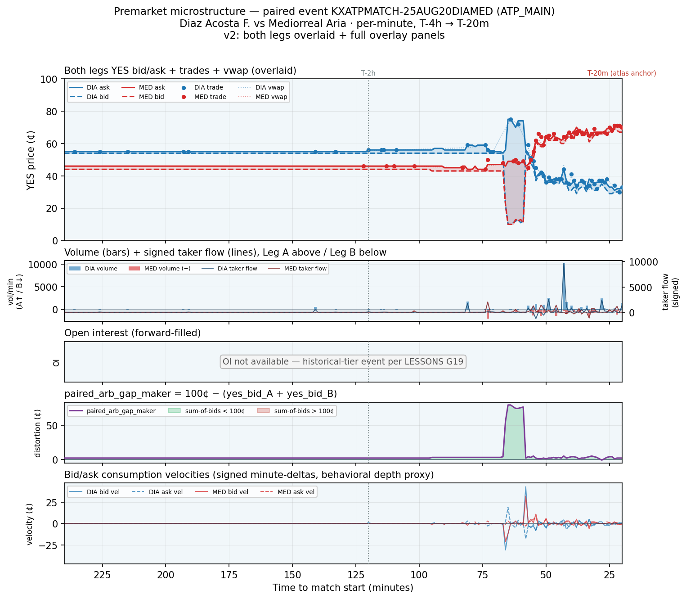

# Example paired-event premarket microstructure (v2) — overlaid both legs with full overlay panels

**Date:** 2026-05-22
**Track:** premarket_dynamics_v1 (microstructure-only premarket descriptive corpus)
**Event:** `KXATPMATCH-25AUG20DIAMED` · **Category:** ATP_MAIN
**Leg A:** `KXATPMATCH-25AUG20DIAMED-DIA` — Diaz Acosta F. (blue)
**Leg B:** `KXATPMATCH-25AUG20DIAMED-MED` — Mediorreal Aria (red)

Upgraded render of the same event as the v1 chart, to enable direct comparison. Both legs are
now overlaid on a single main panel (mirror view) plus four overlay panels (volume/taker-flow,
OI, distortion, consumption velocities). **Descriptive only — no strategy claim, no FV anchor.**

Companion to **v1**: `example_premarket_chain_KXATPMATCH-25AUG20DIAMED.md` /
`example_premarket_chain_KXATPMATCH-25AUG20DIAMED.png` (single-leg-per-panel layout).

## Sources (read-only)

| Artifact | sha256 | role |
|----------|--------|------|
| `data/durable/per_minute_universe/premarket_tape_v1.parquet` | `ff2a63d9951d1a3d6b80044106c96ca9fdfd8d3951590e73eec1b46209c5a214` | per-(ticker,minute) premarket tape — all plotted series |
| `data/durable/spike_volatility_map/atp_main_spike_perN.parquet` | `621c86340b90653e384720b1f10c4617f9fbd64d5f177cbfab0d2153c9ea960f` | atlas ticker list (same selection lineage as v1) |

Producer state: `HEAD == 677c25b14f4f30a39764c959fb40ba0f61883d34` (the v1 chart commit).
Prices stored 0–1 in the tape; plotted and described here in cents (×100). Player names from
`tennis.db` (`players.name`, keyed by the 3-char kalshi_code suffix).

## Observations (descriptive)

**Panel 1 — overlaid bid/ask (mirror view).** With both legs on one axis the no-arb coupling is
directly visible: for the first ~2.5 hours DIA sits at 54¢/55¢ and MED at 44¢/46¢ — two flat,
tight ribbons whose bids sum to ≈98¢, i.e. the constraint is held with a small ~2¢ slack and the
book barely moves. The coupling stays visually tight right up until the back-window repricing,
where the two ribbons **cross and swap places**: DIA's chain walks down from ~55¢ to the low-30s
while MED's walks up from ~45¢ to the high-60s, a near-perfect mirror. The one place the mirror
visibly *breaks* is the repricing burst itself: around T-65m to T-60m DIA's band fans open to a
~65¢-wide gap (bid collapses while a stale ask lingers) — a transient where the two-sided picture
momentarily fails before re-tightening. vwap markers (faint dotted) sit on top of the trade
scatter only in the back half; the front of the window has no prints at all.

**Panel 2 — volume + signed taker flow.** This sharpens v1's "quiet for 2.5h then burst"
observation into a number: **~90% of DIA's volume and ~87% of MED's arrives in the T-90m→T-28m
window**; before T-2h the legs trade essentially nothing (DIA 617 contracts, MED 8). The action
is not symmetric in size — DIA's burst volume (26.2k) is ~1.6× MED's (16.3k) — but it is the same
*sign*: net signed `taker_flow_in_minute` over the burst is positive on both legs (DIA +19.8k,
MED +9.6k), i.e. recorded as net YES-side taker buying on each leg even though DIA's price was
falling. That sign-vs-price tension on the DIA leg is left as a raw observation for the operator;
no causal reading is asserted here.

**Panel 3 — open interest.** `open_interest_ffill` is **null across all 220/221 minutes on both
legs** (null fraction 1.000). This is a 2025-Aug historical-tier event, where OI is expected
absent per LESSONS G19, so the panel is intentionally blank with an explanatory overlay rather
than rendering an empty axis. No OI inference is possible for this event.

**Panel 4 — paired distortion.** Unchanged from v1: flat near +2¢ through the quiet phase, a
single sharp **+80¢ spike at T-65m** (the two resting bids momentarily summing to only ~20¢ as
liquidity is pulled mid-repricing), then full re-convergence to +2¢ by the T-20m anchor. Only one
minute (T-28m, −1¢) shows a would-be cross.

**Panel 5 — consumption velocities.** The signed minute-deltas make the repricing's *mechanism*
visible and confirm it was **chunky, not smooth**: during the burst single minutes show bid/ask
steps of ±30–43¢, not gradual drift. The bid-vs-ask split is cleanly mirrored across the legs —
DIA's book steps **down** on both sides (summed bid velocity −19¢, ask velocity −21¢ over the
burst), while MED's steps **up** on both (bid +23¢, ask +21¢). So for the falling favorite (DIA)
the dominant motion is the whole book sliding lower (bids dropping *and* asks marked down
together), and for the rising side (MED) it is the whole book lifting (asks lifted, bids chasing
up behind them) — rather than one-sided absorption at a fixed level. The velocities are flat at
zero through the entire quiet front of the window.

*This is n=1, the same event as v1, chosen for typical liquidity. No inference about other events
is drawn; corpus-wide queries (e.g. spread compression by category) come next.*

## Chart

Five stacked panels, shared reversed time axis (T-4h = 240 left → T-20m = 20 right). Panel 1:
both legs' YES bid/ask (cents) with spread fills, trade-print scatter, and faint vwap dotted
lines (DIA blue / MED red). Panel 2: per-minute volume bars (DIA above zero / MED below) with
signed taker-flow lines on the right axis. Panel 3: forward-filled OI (null here). Panel 4:
`paired_arb_gap_maker = 100¢ − (yes_bid_A + yes_bid_B)`, green above 0 / red below. Panel 5:
bid/ask consumption velocities (signed minute-deltas, cents). Dashed red = T-20m atlas anchor;
dotted grey = T-2h. Background is uniformly light-blue: the entire window carries the `stable`
premarket-phase label — no `formation` minutes fall inside T-4h→T-20m for this event.
