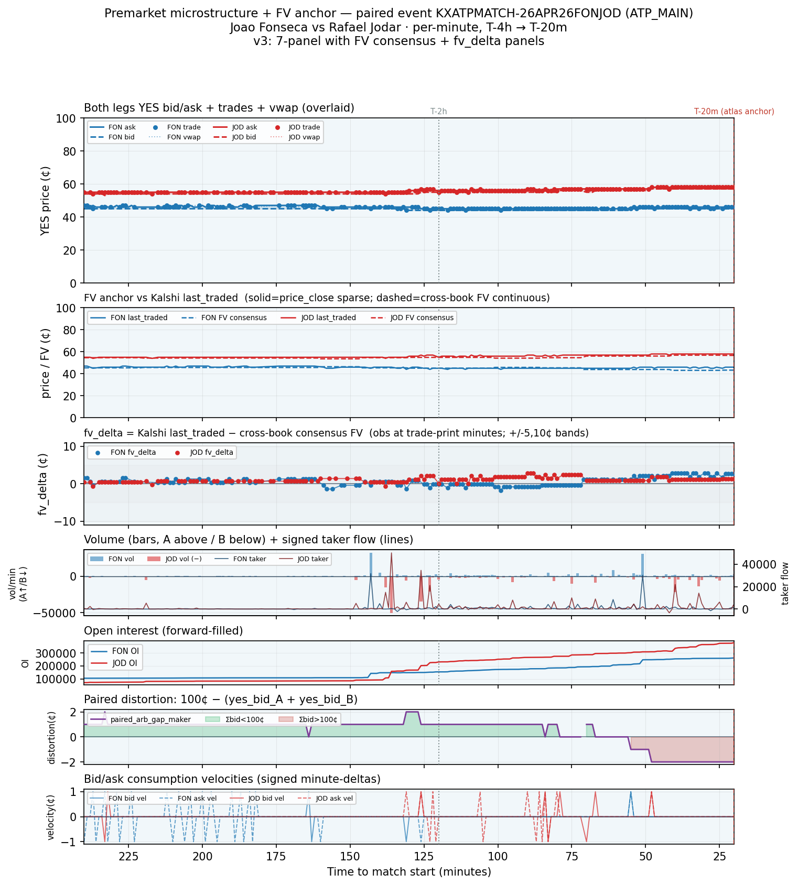

# Example paired-event premarket microstructure + FV anchor (v3) — 7-panel with FV consensus & fv_delta

**Date:** 2026-05-23
**Track:** premarket_dynamics_v1 → Track 2 bridge (FV-conditional premarket dynamics)
**Event:** `KXATPMATCH-26APR26FONJOD` · **Category:** ATP_MAIN
**Leg A:** `KXATPMATCH-26APR26FONJOD-FON` — Joao Fonseca (p1, blue)
**Leg B:** `KXATPMATCH-26APR26FONJOD-JOD` — Rafael Jodar (p2, red)

Adds two FV panels (cross-book consensus vs Kalshi last-traded; fv_delta) to the v2 microstructure
panels, on one ATP_MAIN event from the FV-overlap window where both legs are atlas-deployed and
have **100% FV coverage**. **Descriptive only, n=1 — the corpus-wide query is the empirical test.**
Companions: v1 (`example_premarket_chain_KXATPMATCH-25AUG20DIAMED`) and v2
(`example_premarket_chain_v2_KXATPMATCH-25AUG20DIAMED`).

## Sources (read-only)

| Artifact | sha256 | role |
|----------|--------|------|
| `data/durable/per_minute_universe/fv_overlap_join_v1.parquet` | `58cb0d894d83d782f6a793a060b964565e5484c72da4d01b9a35e43f5cf14e1a` | the joined substrate (all plotted series) |
| `data/durable/per_minute_universe/premarket_tape_v1.parquet` | `ff2a63d9951d1a3d6b80044106c96ca9fdfd8d3951590e73eec1b46209c5a214` | microstructure base of the join |
| `data/durable/spike_volatility_map/atp_main_spike_perN.parquet` | `621c86340b90653e384720b1f10c4617f9fbd64d5f177cbfab0d2153c9ea960f` | atlas anchor-qualification list |

FV resolved from the `fv_history` archive (book_prices, ET-local `polled_at`) via an as-of
carry-forward join: pinnacle (tier-1, 1800s) → aggregate (tier-2, 1800s) → betexplorer (tier-3,
3600s) → unavailable, per fv.py. Prices stored 0–1 in the tape; plotted/described in cents.

## Selection methodology (deterministic)

ATP_MAIN, both legs atlas-qualified (in `atp_main_spike_perN.parquet`), exactly 2 legs, full
T-4h→T-20m window on both (~220 min), **entire window inside FV-archive coverage** (T-4h boundary
≥ 2026-04-19 22:33:45 UTC), ≥20 trade-print minutes per leg, **FV consensus available for ≥80% of
premarket minutes per leg**, then median total volume across both legs (alphabetical tiebreak).
5 events qualified; the median-volume pick is `KXATPMATCH-26APR26FONJOD` — total premarket volume
**488,510** contracts (FON 167,394 / JOD 321,116), 219/220 covered minutes, 159/178 trade-print
minutes, **fv_cov 1.000 on both legs**. Match start 2026-04-26 20:52 UTC.

## Observations (descriptive)

**Panels 2–3 (FV anchor & fv_delta).** This is a calm, deeply-liquid, **tightly FV-anchored**
event: cross-book consensus FV and Kalshi last-traded sit on top of each other near 50¢ the whole
window (Fonseca a marginal favorite), and `fv_delta = last_traded − consensus` is small and
narrowly distributed — FON median **+0.6¢** (range −1.8…+2.9¢), JOD median **+0.9¢** (range
−0.6…+2.8¢). When the market is quiet between trades, the dashed FV line keeps updating from book
polls while the solid last-traded line is sparse (only at prints); when trades do fire, they land
just **above** consensus. The one mild structure: fv_delta **widens late** — FON's mean goes from
**+0.5¢** before T-2h to **+2.2¢** in the last hour (JOD +0.7¢ → +1.2¢) — i.e. Kalshi last-traded
drifts to a small premium over consensus approaching the match, rather than converging onto it.

**Operationally critical question (flagged, not concluded).** The motivating Track-2 hypothesis is
whether fv_delta opens up *before* the microstructure activity (volume burst, BBO-velocity
discontinuities, distortion spike) that Round 4 identified — i.e. FV-gap as an even-earlier leading
indicator. **This single event cannot answer it**, and importantly it illustrates the *opposite*
regime from the v2 DIAMED example: here FV and Kalshi agree tightly throughout, the paired
distortion never leaves ±2¢ (no repricing, no favorite-flip), volume peaks early-to-mid window
(T-143m / T-136m, not in a late burst), and OI builds steadily (Panel 5, live-tier — OI is present
for this Apr-2026 event, unlike the historical v2 example). With essentially no dislocation to
lead, fv_delta stays small. The contrast is itself the useful observation: **tight fv_delta
co-occurs with calm microstructure here, large distortion co-occurred with a favorite-flip there** —
but ordering/causation across events is exactly what the corpus query must settle. Operator to
interpret; no claim drawn from n=1.

## Chart

Seven stacked panels, shared reversed time axis (T-4h=240 left → T-20m=20 right). (1) both legs'
YES bid/ask + spread + trade prints + vwap; (2) FV consensus (dashed, continuous) vs Kalshi
last-traded (solid, sparse) per leg; (3) fv_delta at trade-print minutes with ±5/±10¢ bands;
(4) volume bars (FON above / JOD below) + signed taker flow; (5) forward-filled open interest
(populated — live-tier event); (6) paired distortion `100¢ − (yes_bid_A + yes_bid_B)`; (7) bid/ask
consumption velocities. Dashed red = T-20m atlas anchor; dotted grey = T-2h. The window carries the
`stable` premarket-phase label throughout (light-blue shading).
