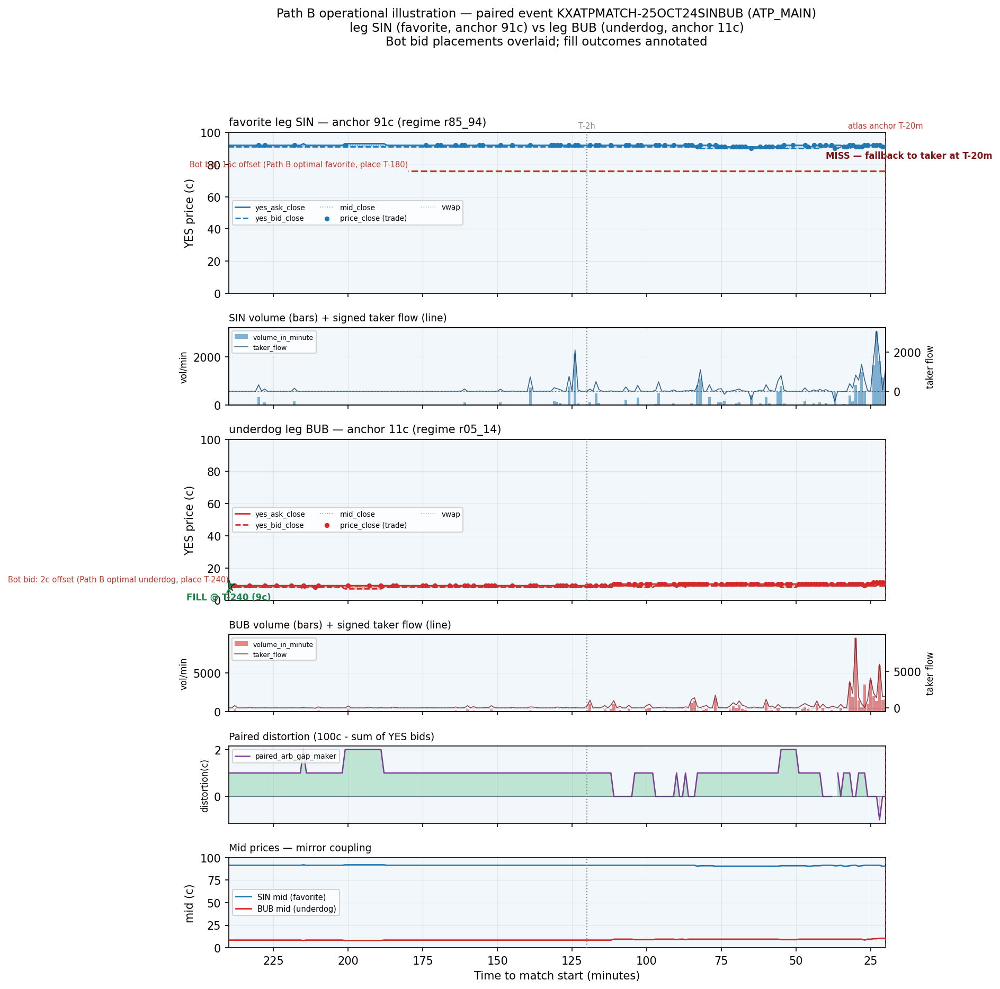

# Path B worked example — paired event with bid-placement overlay

**Date:** 2026-05-23
**Event:** `KXATPMATCH-25OCT24SINBUB` · **Category:** ATP_MAIN
**Favorite leg:** `KXATPMATCH-25OCT24SINBUB-SIN` — anchor **91¢** (regime r85_94)
**Underdog leg:** `KXATPMATCH-25OCT24SINBUB-BUB` — anchor **11¢** (regime r05_14)
**Total premarket volume (both legs):** 86,394 contracts (median of 24 qualifiers).

Single illustrative event showing where the corpus-optimal Path B maker bids would have sat against
where the market actually went, with fill outcomes annotated. **n=1, illustrative — not a corpus
claim** (the corpus-wide measurement is `path_b_fill_mechanics_findings.md`).

> **Player-name caveat.** `name_cache` resolves code `SIN` to "Katerina Siniakova" (a WTA player),
> which cannot be correct for an ATP match where `SIN` is a 91¢ favorite over Bublik — this is the
> known stale-reused-3-char-code artifact (codes are reused across events; cf. the BAS→Michalski /
> Basilashvili case). The event (25-OCT-2025, SIN vs Bublik, ATP) is almost certainly Jannik Sinner
> d. Alexander Bublik. Legs are labeled by kalshi code + role here rather than propagating the
> stale name.

## Sources (read-only)

| Artifact | sha256 |
|----------|--------|
| `premarket_tape_v1.parquet` | `ff2a63d9951d1a3d6b80044106c96ca9fdfd8d3951590e73eec1b46209c5a214` |
| `path_b_per_regime_fill_summary_v1.parquet` | `d9e2c3c55c6d7fb5d93beeddfde8a40f1298b841a0547d3743e14cd21e64e37e` |
| `atp_main_spike_perN.parquet` | atlas membership + anchor_price |

## Selection methodology (deterministic)

ATP_MAIN; both legs atlas-qualified; one leg anchor ∈ [85,94]¢ (heavy favorite) and its partner ∈
[5,14]¢ (deep underdog); both legs full T-4h→T-20m window (~220 min) with ≥20 trade-print minutes;
median total volume across both legs (alphabetical tiebreak). 164 fav+dog paired events → 24
qualifiers → median-volume pick `KXATPMATCH-25OCT24SINBUB`.

## Bid placement (from Path B per-regime optimal)

Looked up from `path_b_per_regime_fill_summary_v1.parquet`, the (ATP_MAIN × regime) cell maximizing
`expected_improvement_cents`:

- **Favorite (r85_94):** placement **T-180**, offset **15¢** → bid level **76¢** (corpus fill_rate 0.42, expected_improvement 6.28¢).
- **Underdog (r05_14):** placement **T-240**, offset **2¢** → bid level **9¢** (corpus fill_rate 0.53, expected_improvement 1.06¢).

## Observational walkthrough

**Favorite leg (SIN) — MISS.** This was a *very* strong favorite from the start: its mid sat at
**92¢ at T-4h and 90¢ at T-20m** — essentially flat, drifting slightly *down* rather than up. (That
runs counter to the r85_94 corpus average of ~+11¢ upward drift, but it is exactly what you expect
for a favorite already priced near its ceiling at T-4h — there is no room left to climb into a deep
bid.) The 76¢ maker bid (15¢ below the 91¢ anchor) was therefore never approached: neither
`yes_ask_close` nor any trade print fell to 76¢ at any minute in the T-180→T-20m window. **Outcome:
miss → fallback to taker at the 91¢ anchor at T-20m** (zero entry improvement on this leg). This is a
concrete instance of the favorite regime's ~58% miss rate — the aggressive 15¢ offset pays a large
6.3¢ expected improvement *because* it captures the full 15¢ on the ~42% of favorites that do drift
up, but on a favorite already pinned high it simply does not fill.

**Underdog leg (BUB) — FILL at T-240 (9¢).** The underdog opened *below* its eventual anchor
(**8¢ at T-4h → 11¢ at T-20m**, a ~3¢ upward drift). Because it started at 8¢, the 9¢ bid (2¢ below
the 11¢ anchor) was immediately marketable at placement — the ask was already ≤ 9¢ at T-240, so the
bid filled at once at ~9¢, capturing the 2¢ improvement versus the T-20m taker anchor. (Honest
nuance: at placement this is a marketable-limit cross rather than a passive rest that the market
later drifts into — Path B's fill condition, `price_close ≤ bid OR yes_ask_close ≤ bid`, counts
both, and here the leg simply opened cheaper than the small-offset bid.) The underdog carried the
bulk of the event's volume (60,860 vs the favorite's 25,534), busiest around T-30m.

**Mirror coupling & distortion.** Panel 6 shows the two mids as near-flat parallel rails (~90¢ / ~10¢)
summing to ~100¢ throughout — a lopsided, well-priced match with little premarket repricing on
either side. Paired distortion stays modest (0 to ~8¢). The contrast between the two legs is the
takeaway: the favorite's high-offset bid **missed** while the underdog's low-offset bid **filled** —
the same favorite/underdog asymmetry Path B measures at corpus scale, here visible on one event and a
reminder that per-event fill is uncertain (the corpus fill_rates are 0.42 / 0.53, not 1.0).

## Disclosure

Single event, n=1, illustrative — not a corpus claim. Fill is detected at minute cadence
(no sub-minute / queue modeling). Hindsight-optimal placement (the regime is assumed known). The
corpus-wide measurement and caveats live in `path_b_fill_mechanics_findings.md` (T43). Player names
unresolved due to stale `name_cache` code reuse (see caveat above).

## Chart

