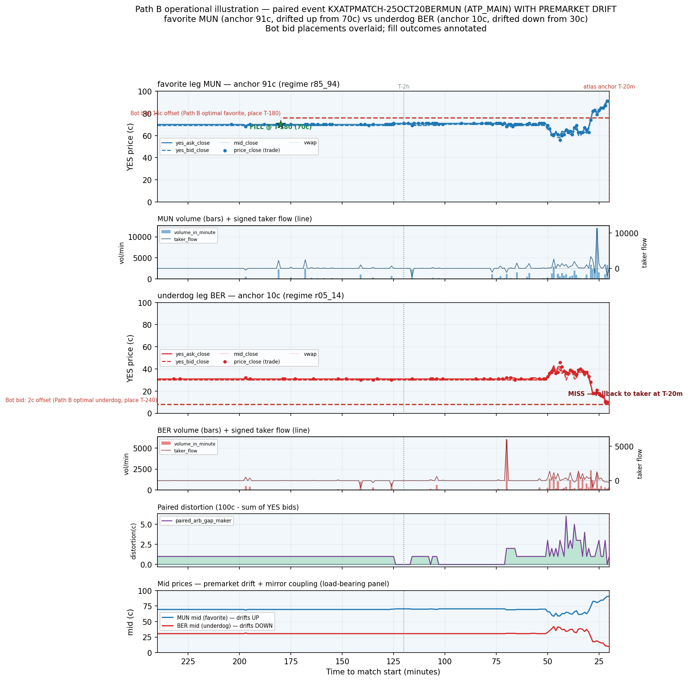

# Path B worked example v2 — paired event WITH premarket drift

**Date:** 2026-05-23
**Event:** `KXATPMATCH-25OCT20BERMUN` · **Category:** ATP_MAIN
**Favorite leg:** `KXATPMATCH-25OCT20BERMUN-MUN` — Jaume Munar — anchor **91¢** (r85_94), mid **70¢ → 90¢ (+21¢)**
**Underdog leg:** `KXATPMATCH-25OCT20BERMUN-BER` — Matteo Berrettini — anchor **10¢** (r05_14), mid **30¢ → 10¢ (−21¢)**
**Total premarket volume (both legs):** 91,083 (MUN 61,083 / BER 30,000).

This v2 example deliberately selects from the half of the corpus that **drifted** — to make the Path
B premarket drift mechanic visible — after the v1 example (`KXATPMATCH-25OCT24SINBUB`, commit
`5e37400`) happened to land on a no-drift event where the favorite was already pinned at its ceiling.
**n=1, illustrative — not a corpus claim** (corpus measurement is `path_b_fill_mechanics_findings.md`).
(Name_cache resolved both codes to plausible ATP players here, unlike v1's stale `SIN`→Siniakova.)

## Sources (read-only)

| Artifact | sha256 |
|----------|--------|
| `premarket_tape_v1.parquet` | `ff2a63d9951d1a3d6b80044106c96ca9fdfd8d3951590e73eec1b46209c5a214` |
| `path_b_per_regime_fill_summary_v1.parquet` | `d9e2c3c55c6d7fb5d93beeddfde8a40f1298b841a0547d3743e14cd21e64e37e` |
| `atp_main_spike_perN.parquet` | atlas membership + anchor_price |

## Why this example was selected

Programmatic, all filters held (no relaxations): ATP_MAIN; both legs atlas-qualified; favorite anchor
∈ [85,94]¢ and underdog anchor ∈ [5,14]¢; both full T-4h→T-20m window; **favorite mid at T-4h ≤
anchor−6¢** (started ≥6¢ below its end) and **underdog mid at T-4h ≥ anchor+6¢** (started ≥6¢ above
its end); total volume in the candidate-pool 25–75th percentile [42,598 / 297,622]; ≥20 trade-print
minutes per leg. **7 events qualified**; the pick is the **median by total drift magnitude**
(|fav_drift| + |dog_drift|), not the maximum — a representative drift, not an outlier. This event's
drift magnitude is ±21¢ on each leg.

## Path B bid placements (from `path_b_per_regime_fill_summary_v1`)

- **Favorite (r85_94):** T-180, 15¢ offset → bid **76¢** (corpus fill 0.42, exp 6.28¢).
- **Underdog (r05_14):** T-240, 2¢ offset → bid **8¢** (corpus fill 0.53, exp 1.06¢).

## What the chart shows

**Panel 6 (mid overlay) — the load-bearing visual.** The two mids start *converged toward the
middle* (MUN 70¢, BER 30¢ — sum ~100¢) and then fan apart over the back half of the window: MUN's mid
**climbs 70¢ → 90¢** while BER's **falls 30¢ → 10¢**, the two staying mirror-coupled (sum near 100¢
throughout). The bulk of the move is a late repricing (roughly T-90m onward), not a smooth glide — the
lines are near-flat until ~T-60m then diverge sharply. This is the drift the Scope A T4 gradient
describes, here realized on a single event at the heaviest-favorite / deepest-underdog tiers.

**Panel 1 (favorite MUN) — FILL at T-180, ~70¢.** Because the favorite was *cheap early* (70¢ at
T-4h, still ~70¢ at the T-180 placement), the 76¢ bid was immediately marketable and filled at ~70¢ —
**21¢ below the 91¢ anchor**, even better than the 15¢-offset bid level. The bot then holds a favorite
bought at 70¢ that proceeds to drift up to 90¢. This is the up-drift thesis in its purest form: the
favorite is underpriced early relative to where the market settles it, and an early maker bid captures
that gap. Favorite volume was heaviest at T-26m (late), consistent with the late repricing.

**Panel 3 (underdog BER) — MISS.** The underdog drifted *down* exactly as the thesis predicts (30¢ →
10¢), but the down-drift **terminated at its 10¢ anchor and never reached the 8¢ bid** (2¢ below
anchor). So the small-offset underdog bid narrowly missed → fallback to taker at the 10¢ anchor. This
is the honest subtlety of the underdog side: a bid placed *below* the anchor only fills when the
underdog either starts below it (cf. v1's BER, which opened at 8¢ under a 9¢ bid and filled at once) or
*overshoots* below the anchor — a down-drift that lands at the anchor does not reach it. It is exactly
why the r05_14 optimum is a *small* 2¢ offset at a 53% fill rate, not a large offset.

## Comparison with v1 (SIN/BUB, no drift)

Not every event drifts — the corpus average is an *average over a wide population*. v1
(`KXATPMATCH-25OCT24SINBUB`) showed a favorite already pinned at 90–92¢ at T-4h (no upward room → the
15¢-offset bid missed) and an underdog that opened below its small-offset bid (trivial immediate fill).
v2 shows the opposite favorite case — a favorite that started 21¢ cheap and drifted up, filling richly
at 70¢ — and an underdog whose down-drift stopped at the anchor and missed the sub-anchor bid.
Together the two examples bracket the population variance behind Path B's corpus statistics: the
favorite-side fill rate of 0.42 means events like v2 (fill, big improvement) and v1 (miss) both occur,
and the single-event outcome is genuinely uncertain — the corpus 2.46¢/N hindsight ceiling is the
average over exactly this spread, not a guarantee on any one event.

## Disclosure

Single event, n=1, illustrative. Fill detected at minute cadence (no sub-minute / queue modeling).
Hindsight-optimal placement (regime assumed known). The favorite fill here is marketable at placement
(favorite cheap early), not a passive rest the market later drifts down into — Path B's fill condition
(`price_close ≤ bid OR yes_ask_close ≤ bid`) counts both. Corpus claim and caveats: Path B findings
(T43), 2.46¢/N hindsight ceiling. v1 (no drift) + v2 (substantial drift) jointly illustrate the
population variance behind the corpus average.

## Chart

