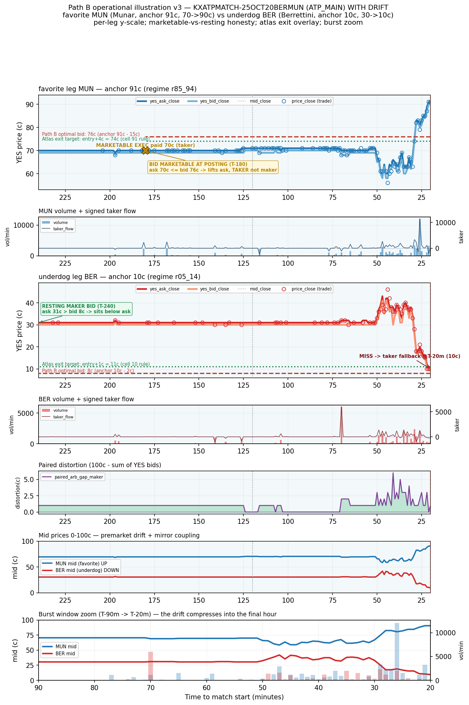

# Path B worked example v3 — corrected rendering + atlas exit overlay + marketable-vs-resting honesty

**Date:** 2026-05-23
**Event:** `KXATPMATCH-25OCT20BERMUN` · **Category:** ATP_MAIN (same event as v2; re-rendered)
**Favorite leg:** `…-MUN` — Jaume Munar — anchor **91¢** (r85_94), mid **70¢ → 90¢**
**Underdog leg:** `…-BER` — Matteo Berrettini — anchor **10¢** (r05_14), mid **30¢ → 10¢**

v3 fixes the v2 rendering (fat overlapping lines on a 0–100 axis hid the microstructure) and adds the
locked atlas exit rule plus an honest marketable-vs-resting distinction at the posting moment.
**n=1, illustrative.**

## Sources (read-only)

| Artifact | sha256 |
|----------|--------|
| `premarket_tape_v1.parquet` | `ff2a63d9951d1a3d6b80044106c96ca9fdfd8d3951590e73eec1b46209c5a214` |
| `atp_main_descriptive_1c.parquet` | atlas per-cell exit rule (cells 91, 10) |
| `path_b_per_regime_fill_summary_v1.parquet` | `d9e2c3c55c6d7fb5d93beeddfde8a40f1298b841a0547d3743e14cd21e64e37e` |

**Atlas exit rules (read from `atp_main_descriptive_1c.parquet`):** cell **91 → "exit at +4¢"**
(hit_rate 1.000, N=29); cell **10 → "exit at +1¢"** (hit_rate 0.903, N=31).

## Rendering corrections vs v2

Per-leg auto-scaled y-axes (MUN ≈ 62–95¢, BER ≈ 5–40¢ — not 0–100); ask/bid as distinct-shade solid
weight-2.5 lines; mid de-emphasized (dotted, alpha 0.5); trade prints as open markers (book lines
visible behind); spread shaded alpha 0.10; Path B bid level (red dashed) and atlas exit target (green
dotted) overlaid with edge labels; marketable-vs-resting annotation at the posting minute; a 7th
burst-zoom panel (T-90m→T-20m, mids + volume) showing the final-hour compression.

## The actual strategy this chart illustrates

**1 — What the bot does at T-4h given Path B's placement.** On **MUN**, Path B says post a bid at
76¢ (91¢ anchor − 15¢). But at the T-180 placement minute the ask is already **70¢** — *below* the
76¢ bid. The bid is therefore **marketable**: posting it lifts the 70¢ ask and the bot executes as a
**taker at 70¢, not a resting maker**. (It captures 21¢ below the 91¢ anchor — more than the 15¢
offset implies — but as a taker, paying the taker fee.) On **BER**, Path B says post a bid at 8¢
(10¢ anchor − 2¢); at the T-240 placement the ask is **31¢**, so the 8¢ bid sits as a genuine
**resting maker bid 23¢ below market** and waits. Through the calm window (T-4h→T-60m) MUN is already
filled and BER's bid sits unfilled while the market hovers ~28–32¢. During the burst (T-60m→T-30m)
BER falls from ~30¢ to ~10¢ — but it **terminates at its 10¢ anchor and never reaches the 8¢ bid**, so
the resting bid still does not fill. At T-20m BER falls back to a **taker cross at ~10¢** (the anchor).
The bot ends holding **both legs: MUN at 70¢, BER at 10¢ — sum-of-entries 80¢** on a paired binary that
always settles at 100¢, i.e. **+20¢ per paired-event before any exit logic**.

**2 — The atlas exit rule then applies (to whatever entry the bot achieved).** MUN cell-91 rule is
"exit at +4¢": from the 70¢ entry the exit target is **74¢**, which the favorite's climb to 90¢ clears
almost immediately (the green dotted line sits just above entry) → realize +4¢. BER cell-10 rule is
"exit at +1¢": from the 10¢ entry the target is **11¢** (hit_rate 90.3% historically). Net per-leg
P&L = exit_payout − entry. (Subtlety, stated honestly: the atlas measured "+4¢" / "+1¢" relative to
the **T-20m anchor** entry, 90¢/10¢; applying the same +X¢ rule to our *earlier, cheaper* Path B entry
(70¢) re-uses the rule's shape at a different entry price — it is an extrapolation, not the exact
quantity the atlas measured.)

**3 — Measurement gap this event reveals in Path B (flag for a LESSONS entry).** Path B's
`fill_outcome` recorded MUN as a "fill" at the 76¢ bid level — but it was a **marketable execution at
the 70¢ ask**, a taker, not a maker fill at 76¢. Path B's fill condition
(`price_close ≤ bid OR yes_ask_close ≤ bid`) **conflates two distinct execution modes**: (a) a resting
maker bid that the ask later descends to (true maker fill at the bid price, maker fee), and (b) a bid
already above the market at posting that crosses the spread immediately (taker at the ask, taker fee,
and a *better* price than the bid). For the marketable-at-posting sub-population, Path B's per-fill
improvement (anchor − bid_level) is **understated** (true capture is anchor − ask, often larger) and
the execution is taker not maker; for the resting sub-population the maker-fee saving applies but the
full offset is not always realized. **Recommended follow-up: split `fill_outcome` into
{maker_fill, marketable_taker, miss} and re-aggregate Path B's expected_improvement by execution
mode.** (This complements LESSONS A40, which caught the entry-vs-exit baseline conflation; this is an
entry-side execution-mode conflation within Path B itself.)

**4 — The deployable single-rule policy (no embellishment).** For each atlas-qualifying paired event,
at the placement minute evaluate each leg's **current ask vs the Path B target bid**:
(i) **if target bid > current ask** → the bid is marketable; execute as **taker at the current ask**,
record entry = ask, and move on (do not sit a marketable bid);
(ii) **if target bid ≤ current ask** → post a **resting maker bid at the target**; if it fills at any
minute, take it; if unfilled by T-20m, **fallback taker cross at T-20m** at the ask.
Then apply the atlas per-cell exit rule from entry forward. That is the actual deployable single-rule
policy; per-regime offset tuning (Stage 2) and a burst-window override (Stage 3) layer on top per
Plex Round 6's staged composition. On this event the rule yields MUN taker@70¢ (marketable) and BER
resting→miss→taker@10¢ (fallback).

## Disclosure

Single event, n=1, illustrative. Fill/marketability detected at minute cadence (no sub-minute / queue
modeling); the "marketable at posting" call uses the ask at the placement-minute close. Atlas exit
targets are drawn as entry+X¢ per the prompt's framing (see the §2 extrapolation caveat). Corpus claim
and caveats live in `path_b_fill_mechanics_findings.md` (T43). v1 (no drift), v2 (drift), and v3
(corrected rendering + execution-mode honesty) together illustrate the population variance and the
execution-mode nuance behind Path B's corpus statistics.

## Chart

