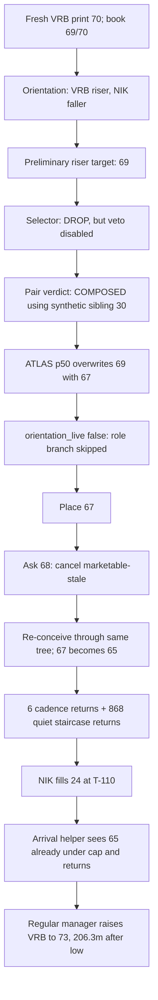
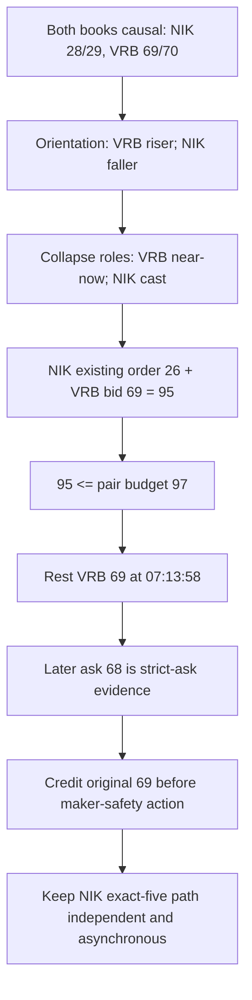

# NIKVRB two-leg decision-tree reference

This document sits beside `NIKVRB_DECISION_AUTOPSY.md`. The autopsy says what each organ returned. This reference says what the return meant **inside the path that made it reachable**.

It is a one-game structural validation only. It does not modify `live_v4.py`, execute a replay, score the 804, or grant any organ global authority.

## Answer first: the single divergence

At **07:13:58 ET (T-316.033 scheduled / T-321.033 bell)**, the joint orientation prior had already classified VRB as the riser with conviction 1.0. Inside `_v4_entry_anchor`, that door made VRB's role-specific preliminary target the live bid, **69**. NIK's faller order was already resting at 26, so the joint proposed basis was 95, inside the 97 pair budget.

The tree then left that branch. `_initial_entry_aim` recomputed VRB independently as `70 - ATLAS p50 3 = 67`. Because `orientation_live=false`, lines 12095-12110 did not restore 69. Line 12163 assigned 67.

**The divergence is: orientation opened the correct riser branch, but the final aim layer did not consume the branch.**

Changing that one decision node at this call rests 69 for 84 seconds before the ask returns to 68. Under strict-ask-credit-before-cancel law, it fills once at the original 69 on visit 2. If cancellation is allowed to run first, it cancels and reconceives 67. That execution ordering is a separate invariant; the trace does not conceal it.

## The tree the OS walked

The five priced calls and all 6,408 receipt-resolvable repeated returns are in `NIKVRB_PATH_DECISION_LEDGER.csv`. Calls are labeled `DISCOVERY_REALIZED`, `REALIZED_AFTER_MARKETABLE_STALE_GATE`, `REALIZED_AFTER_RESTING_GATE`, or `REALIZED_AFTER_FILL_GATE`; later organs are not misreported as discovery facts.

The committed trace also reports 349 VRB and four NIK `skip_no_trade` observations. Their state transitions and counts survive, but the referenced full per-call trace is absent. They remain an aggregate evidence boundary and are not assigned fabricated timestamps. The 13,123-row market clock is complete market chronology; it is not falsely relabeled as 13,123 OS calls.

## What each later organ meant after the door

| Door already taken | Later return | Meaning in that branch | What became unreachable |
|---|---|---|---|
| Fresh-print anchor | native cell/page | A priced consultation may exist | No-fresh-trade skip path |
| Orientation says VRB riser | preliminary 69 | near-now riser catch while NIK casts | symmetric depth should be contextual, not a role reset |
| Selector returns DROP | -6.5% | a veto only if enforcement is enabled | Nothing; enforcement was false |
| Pair returns COMPOSED | 93 | synthetic-complement composition label | Actual NIK 28/29 state remains unread by this organ |
| ATLAS p50 | 67 | independent depth target | The already-open 69 branch is overwritten |
| `orientation_live=false` | skip | ATLAS remains signer | role-conditioned 69 cannot return |
| VRB entry_resting | cadence/staircase return | preserve 65 FIFO | best-bid mismatch, recurrence, window truth, cohort, repost |
| NIK phase active | manager guard false | exact-five leg is done | every fourth-move/re-buy path, correctly |
| NIK first fill | pair headroom 73 | sibling price becomes lawful | early VRB pulse is already historical |

Band and tick semantics are branch-conditioned. VRB's B4/flat state arrived at 07:14:42, after the riser door and first order. Inside a VRB-riser branch, “flat” is compatible with a shallow retouch; it does not logically reset the leg to symmetric deep-cast posture. Conversely, a downward tick in NIK's faller branch supports patience until fill, but becomes entry-ineligible afterward. These interpretations are structural diagnostics: the frozen code does not contain a source-proven composed band/flow action mapping, so this reference does not invent one.

## Counterfactual junctions

| Changed door | Path opened | Position before the 68 pulse | Result on this specimen |
|---|---|---:|---|
| Consume orientation-riser at 07:13:58 | role target 69 | 69 | Strict ask 68 credits 69 on visit 2; cancel-first ordering falls back to 67. |
| Use JOIN as numeric control | contemporaneous bid 69 | 69 | Frozen JOIN replay completes NIKVRB at NIK 24 / VRB 69; this corroborates price, not structure. |
| Release staircase only | later resting manager | at most 67 | Too late: visits 3/4/9 are already 67/68, so maker-safe ceiling is 67. |
| Enforce contention DROP | refusal | none | Worse: no VRB exposure. |
| Wait for band B4 | band-aware path after 07:14:42 | not present at 07:13:58 | Too late and flat does not uniquely select 69. |

### Visits 3, 4, and 9

| Visit | Clock at start | Actual | Orientation branch with strict-ask credit | Orientation branch with cancel-first ordering |
|---:|---|---|---|---|
| 3 | T-308.800 / T-313.800 | REST_65__QUIET_STAIRCASE_HOLD | ALREADY_FILLED_AT_69__NO_RESTING_ENTRY | REST_67__NOT_68_OR_69 |
| 4 | T-307.800 / T-312.800 | REST_65__QUIET_STAIRCASE_HOLD | ALREADY_FILLED_AT_69__NO_RESTING_ENTRY | REST_67__NOT_68_OR_69 |
| 9 | T-299.717 / T-304.717 | REST_65__QUIET_STAIRCASE_HOLD | ALREADY_FILLED_AT_69__NO_RESTING_ENTRY | REST_67__NOT_68_OR_69 |

There is no honest late single-door change that rests 68 or 69 during these visits: ask is already 68, so a maker buy cannot exceed 67. The useful door is earlier.

## The tree it should have walked

This is not “orientation wins a vote.” It is: orientation selects a branch; within the riser branch, near-now has a different meaning than it has for the faller. The sibling state constrains the price simultaneously but the legs may fill hours apart.

## Joint tree: where sibling state is and is not read

At the decisive VRB print, the actual joint state was:

| | NIK | VRB | Total |
|---|---:|---:|---:|
| Bid | 28 | 69 | 97 |
| Ask | 29 | 70 | 99 |
| Last | 32 | 70 | 102 |
| Proposed role-path order | 26 | 69 | 95 |

The inverse constraint collapses the roles: VRB-riser near now and NIK-faller cast. `_orientation_prior` reads both bids and sees this. `_pair_verdict` does not: it substitutes `100-current`. `_pair_seesaw_state` reads the sibling only as a refusal ceiling. `_initial_entry_aim`, which signs, returns to a one-leg ATLAS number.

Thus sibling state becomes readable before pricing, is partially read, and is then discarded at the signing junction. It becomes authoritative only after NIK fills, when it is 206.3 minutes too late for VRB's low.

## Time is the branch-availability axis

| Time | Scheduled / bell | Door availability |
|---|---|---|
| 06:28:05 | T-361.917 / T-366.917 | NIK discovery; orientation already identifies VRB riser/NIK faller. |
| 07:13:56.179481 | T-316.064 / T-321.064 | VRB print 70; actual joint state becomes causal. |
| 07:13:58 | T-316.033 / T-321.033 | The 69 riser path exists. This is the decisive junction. |
| 07:14:42 | T-315.300 / T-320.300 | VRB B4/flat appears only after first placement. |
| 07:15:22 | T-314.633 / T-319.633 | Ask 68 returns; a 69 order has evidence now. |
| 07:21-07:39 | T-308.8..T-291 / T-313.8..T-296 | Visits 3-9; late maker ceiling is only 67. |
| 10:39:57.500480 | T-110.042 / T-115.042 | NIK fills 24; post-fill sibling door opens. |
| 10:40:14 | T-109.767 / T-114.767 | VRB raises to 73 after its pulse window; minimum afterward is 74. |
| 11:09-11:38 | T-80.8..T-51.2 / T-85.8..T-56.2 | NIK slides to 18, but its exact-five entry branch is already closed. |

VRB's actionable pulse path exists before T-120. NIK's material slide is after it. A pair organ invoked only after the first fill cannot recover the early branch; in this event, “late” means “nonexistent.”

## Validation ruling before 804

NIKVRB validates the **structure**:

1. a joint orientation call can open role-specific child paths;
2. the actual signer can overwrite that path and erase its meaning;
3. the sibling is observable early enough to enforce the 97 budget;
4. a later resting-manager change cannot recreate the early 69 door;
5. strict ask credit must precede maker-safety cancellation for the original exposure;
6. NIK's post-fill decline must remain outside entry authority.

It does **not** validate a global flag or an 804-event strategy. Enabling `orientation_live` globally also deepens faller calls (for example NIK's p75 path), so that complete branch must be replayed causally before population use. No 804 run is performed here.

## Reproduction and containment

- Build: `node arb-executor/analysis/build_nikvrb_decision_tree_reference.js .`
- Verify: `node arb-executor/analysis/build_nikvrb_decision_tree_reference.js . --check`
- Focused test: `node arb-executor/tests/test_nikvrb_decision_tree_reference.js`

All inputs are hash-bound in `SOURCE_HASH_MANIFEST.json`. No scorer, live engine, holdout, network, order, position, exit, settlement, DCA, or Window-2 surface is accessed.
