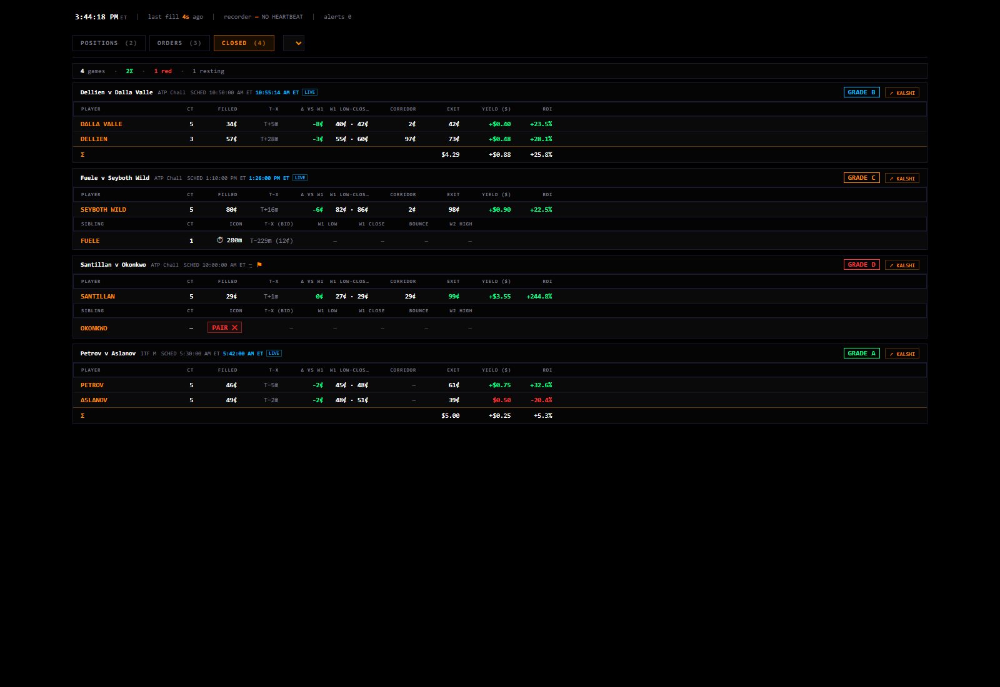
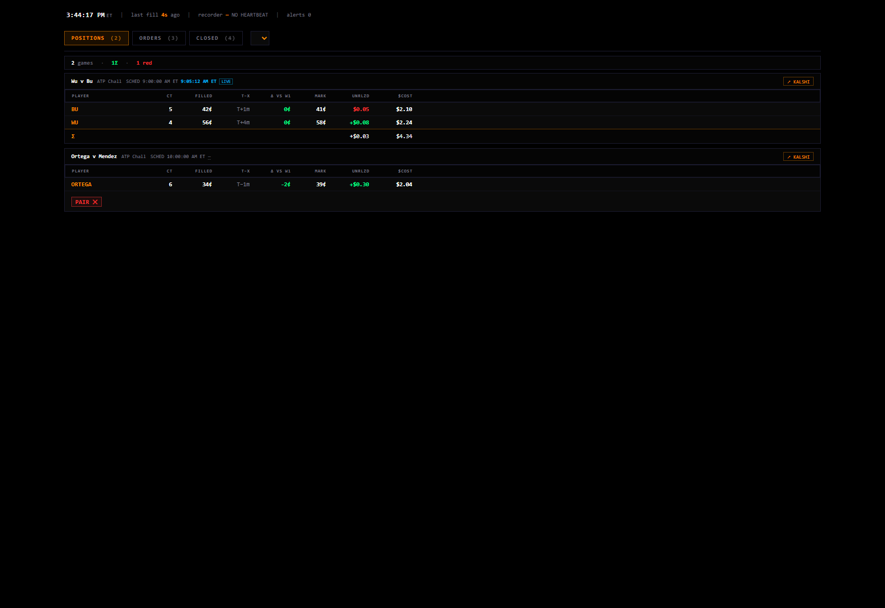
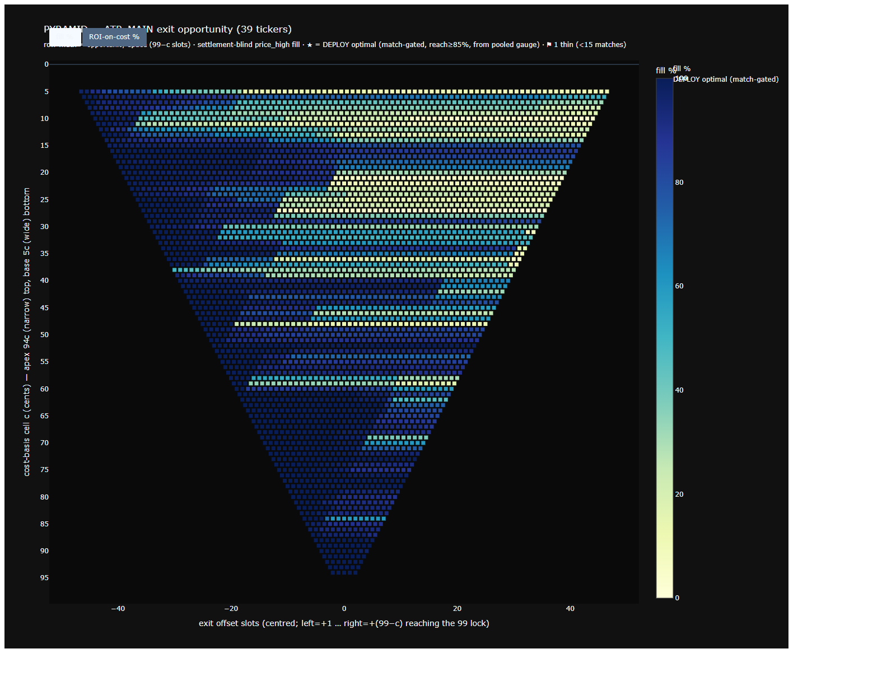

# FACE v3 — discovery, design brief, Astra review

2026-09-12 · baseline `4fe7a88694ddd4946fa871f0071db29514d1f2ce` · branch `face/window1-watch-20260903`.

**Review boundary, not a completed v3 build.** No engine, execution, pricing, pool, rubric, source tape, or sealed archive changed. No LIVE_PAPER process started. Historical screenshots below use committed fixtures/artifacts, not current account data. A live-data custody conflict prevents signing LIVE activation.

Current dual-belief OS SHA256: `70b68856cb4f0329048f9ae951e01c19c7d7465e3cc0ee183e325ce6c1fb0346`. The runtime must pin its transitive modules and corpus/contract receipts too: the top file alone does not identify the machine.

## 1. Discovery

The closest predecessor is **the Python Day Sheet served by fund_tracker on localhost:8788**. It superseded the React Day Sheet pair lens. OMI Terminal supplied a terminal layout; it was not that per-game floor grader.

All paths below are repository-relative. Commits identify prior art, not authority to resurrect its trading rules.

| Candidate / prior art | Paths | Display and grading | Render status |
|---|---|---|---|
| OMI Terminal: `914388a7`; later shell `0ad52736` | `components/terminal/{Terminal,Orderbook,Scanner,PositionsTable,PnL,CountdownBoard,OrderEntry}.tsx`; `app/edge/trading/exchange/page.tsx` | Watchlist, scanner, depth, inventory, countdown, strategy P&L, trades/winners, hold time and edge. No v54 per-game floor letter. Includes real order POST/DELETE wiring. | Source inspected; account-connected Next app not started. No isolated fixture harness found; no fresh screenshot claimed. |
| Performance & Grading / Accuracy: `281bce1f`, `92e7cd41` | `app/internal/edge/page.tsx`, `backend/{internal_grader,accuracy_tracker}.py`; `app/edge/portal/results/page.tsx` | Predictions against final scores and per-book lines; correct/incorrect/push, confidence tiers, sport/market/pillar splits, hit rate, ROI, calibration with n, date filters, database coverage diagnostics. Grades spread/total/moneyline, not paired pre-bell floors. | Source inspected; no production database or manual regrade endpoint used. No fresh screenshot claimed. |
| Game-detail/operator surface: `c354801e`, polish `8db66407` | `components/edge/GameDetailClient.tsx`, sports game-detail routes | One-game fair value, market lines, confidence and explanations. Companion prediction surface, not a separate floor ruler. | Source/history inspected; not connected to backend. |
| React Day Sheet: `6673d04e`, pair view `7e3b7b54`, localhost bundle `155a1d6b` | `components/trading/arb/panels/daysheet/`, `lib/trading/daysheet-parser.ts`, `tools/daysheet_local/entry.tsx` | Pair lens plus SETTLED/OPEN/UNFILLED/NOT BID; fill versus aim, own W1 low/time, placed→filled→bell→exit, missing-side reasons, participation funnel. Parses filed reports. | Bundle exists, but explicitly superseded by Python panel. Original build's esbuild dependency is unavailable locally; no rebuild claimed. |
| **Python Day Sheet: `439695d9`, deployed `becbe911`; refinements through `2bb4fe15`** | `arb-executor/tools/{daysheet_panel,daysheet_template,fund_tracker}.py`; offline `daysheet_dev_server.py`, `daysheet_fixtures.json` | POSITIONS/ORDERS/CLOSED; one row per side, weighted execution cost, quantity, exit, yield/ROI, sibling disposition, clocks and tape windows. Joins filed grades, then applies evidence/window and pair caps. Missing evidence → UNGRADED. | **Own renderer runs.** Stdlib fixture server, loopback, Python `-B`; two fresh screenshots. No fund_tracker import/start, credential, account API or live DB access. |
| Exit charts: `2424cf1e`, `37226a33`, `ac256a1e`; match weighting `731bc5d8`, full-universe `c2fc37c0` | `arb-executor/analysis/exit_charts/README.md`, `chart_pyramid.html`, `chart_sand_overlap.html`, `chart_mirror_outlook.html`, producers | Exit reach, return, cost basis, mirror, sample/coverage denominators. Research instruments, not entry-pair grades. | Existing interactive pyramid HTML renders. Screenshot is the committed output, **not a fresh population run**. |
| Rejected exit scorecard: `587b5c8d` | `arb-executor/analysis/dead_ends/README.md`, `scorecard_atp_main.*` | Broken grid disagreed with answer key on 82/90 cells. | **REJECT as grading authority.** Not revived. |

Specific evidence: `daysheet_panel.py:1274` grade-evidence law; `:1297` old grade/corrected window; `:1338` pair rule; `:1373` missing sibling disposition. `daysheet_template.py:110` defines closed-row execution/window/exit columns. `OrderEntry.tsx:214` and `:235` invoke real order endpoints and must not be reused as a paper adapter.

### Actual historical renders

Fixture numbers/grades are renderer test data, not current truth or proposed v3 values.







## 2. Concepts to recover; concepts already retained

Comparison target: `window1-watch/grade_rubric.json`, `build_grade.mjs`, `shell/src/components/grade-panel.tsx`. A diagnostic behind a hover or in JSON is not wholly lost.

| Historical concept | Current state | Merge ruling |
|---|---|---|
| All-game ledger: both-filled, one-sided, unfilled, never bid | Per-game picker/grade/history, no consolidated scoreboard | Restore all populations with denominators; never completed-pair-only headlines. |
| Mandatory missing-side disposition: never conceived, attempted, pulled, resting, late trade | Actions/fills exist, but no normalized mandatory explanation | Add side-by-side reason with supporting receipt; unknown intent stays unknown. |
| Evidence-complete versus UNGRADED | STORE SILENT, corrections and fill checks already exist | Preserve; add explicit evidence-completeness column and reasons. |
| Scheduled/observed/estimated clock disagreement; W1/corridor/W2 | Corrected span/bell retained, not every historical window displayed | Surface bound clock and correction lineage. Corridor/W2 only when sourced, never as replacement ruler. |
| Previous grade; charge→amendment→verdict | Grade history and correction provenance exist | Expose revision reason and old/new ruler in drilldown; retain history. |
| Quantity-weighted multi-fill basis, partials, exit, realized/unrealized | Replay mainly carries side entry cents and pair discount | Add only with sourced paper size/fill/settlement records. No invented quantity, dollars or fees. Legacy account ledger stays private. |
| Missing counterpart, naked/vanished order or phantom-position alerts | No live reconciliation surface | Add paper-ledger integrity checks, not real-portfolio claims or legacy exit requirements. |
| Last trade age versus recorder heartbeat | Replay clock/provenance only | Separate trade age, book age, last received frame, sequence continuity and worker heartbeat. Quiet market ≠ dead feed. |
| Listed→considered→bid→one/both-filled funnel | No all-game participation funnel | Restore counts/reasons. Old P-offered meant participation; never confuse it with offered discount in cents. |
| Completion versus capture quality; forgone completion | Per-game completion/capture/trade error exist | Aggregate separately. Incomplete pairs receive zero credited capture. Do not import old 70/70 cutoffs. |
| Churn, placement-to-fill and order lifetime | Lineage age/current-price age and accountability already retained | Surface reasoned reprices and both clocks; no conduct changes. |
| Calibration, n, grouped sport/market/tier/pillar performance, pushes | Bench accuracy, ESS, family/first-call diagnostics exist; no global breakdown | Applicable stored tour/game/OS breakdowns only. No sportsbook grading, confidence conversion or invented pillar scores. |
| Reach versus settlement; cost-basis outcomes; one game one vote; coverage warnings | Oracle, future-print grading, no-offer, ESS already exist | Keep distinctions; add denominator/source columns, not old strategy surfaces as price authors. |

The current four-section operator rubric remains unchanged. Legacy P&L letters, one-sided C/D caps, 99/1 settlement conventions, odds defaults, and rejected exit grids do not become v3 rules. “Authored” remains distinct from Gate-1 certification.

## 3. Bloomberg idiom: a working terminal

Primary question: **what did each side believe, what bid follows, what changed, and did the game offer/fill it?** Density serves comparison, not ornament.

```text
 TUNE | LIVE · PAPER | SCOREBOARD    game ticker strip    connection / data state
 event · OS/dependency/corpus hashes · receipt time · feed lag · source class
 ┌─────────────────────┬────────────────────────┬──────────────────────┐
 │ SIDE A SENTENCE     │ TAPE + Q + REST         │ SIDE B SENTENCE      │
 │ P / Q band / X      │ both sides, same       │ P / Q band / X       │
 │ assumption/renewal  │ verified bell clock    │ assumption/renewal   │
 │ five-level ladder  │ oracle + gap: TUNE     │ five-level ladder    │
 │ size / maker ±     │ or completed game only │ size / maker ±       │
 ├─────────────────────┼────────────────────────┼──────────────────────┤
 │ PILE / ESS         │ PAIR EXPOSURE          │ GRADE + HISTORY      │
 │ author / telemetry │ filled versus resting │ evidence / missing   │
 │ validity source    │ both commitments       │ side disposition     │
 ├─────────────────────┴────────────────────────┴──────────────────────┤
 │ BID LOG: time · side · action · old→new · reason · author            │
 │ replay transport / atlas flags / keyboard help                      │
 └────────────────────────────────────────────────────────────────────┘
```

- Fixed desktop panels; dark ground, restrained amber statuses, existing side colors, monospace/tabular numbers and aligned columns. Small screens stack the same panels. No giant decorative title, ornamental charts or animated invented prices.
- One component shell, distinct TUNE/LIVE stores. A replay never masquerades as live. Preserve all five games, corrected floors, grade/history, oracle/gap, q25–q75/q10, atlas/receipt stepping, four-line bid/fill cards, raw-detail toggles, assumptions/renewals/supersessions, inspector and provenance. Hosted unavailable stages stay explicitly unavailable, not removed.
- Every number carries class (`OS`, `TAPE`, `RULER`, `BENCH`, `PAPER`), source receipt/key, timestamp and binding hash. Derived values are written by builders/adapters with named formulas; UI only renders/selects them.
- Five actual levels on both book sides for each game side. Compact replay faces currently guarantee top prices, not full sizes/depth. Missing levels = STORE SILENT; observed empty level ≠ unavailable capture. No interpolation or invented quantities.
- Maker ± is the approved **net residual**: end size − start size + attributable on-book executions, using the capture's YES/NO convention. Missing attribution or ordering → STORE SILENT. Raw depth delta is separate and is not called maker flow.
- Pile separates selected author from STEP telemetry. ESS is not probability; bench accuracy is not live predictive accuracy. No unsupported validity meter or unfiled threshold.
- Pair view separates filled basis from standing commitments; per-unit pair cents are not dollar exposure. Paper-reachable fills and exchange-confirmed fills are different; this system produces no exchange confirmations.
- Keyboard: `/` game search; previous/next game; `G` gate jump; Space play/pause in TUNE; arrows receipt-step; Escape inspector close. Ignore global shortcuts while typing. LIVE switches follow-latest/frozen inspection, never pretends playback controls the market.

## 4. LIVE_PAPER architecture

```text
 approved non-sealed cohort + receive-time metadata
   → constrained recorder relay / explicitly read-scoped ingress
   → ordered validated receipts + durable source ledger
   → unchanged OS bundle + pinned library/contract (no exchange key/network)
   → sentences / assumptions / renewals / actions
   → paper ledger: strictly later, positive-size, on-book print witnesses
   → read-only face API / bounded public snapshots
   → settlement + complete lawful span → same grade builder → scoreboard/history
```

Required invariants:

1. No order client, order endpoint, portfolio mutation, old OrderEntry wiring, or permissive paper→real fallback. The OS worker receives data, not Kalshi credentials; it cannot send exchange requests. Red PAPER is a warning label, not the safety boundary.
2. An explicitly verified read-only key or a constrained credential-free relay from an appropriately isolated recorder. “The recorder only reads” does not prove its key cannot trade. WebSockets authenticate the handshake; omitted key scopes default to broad access. No existing key is assumed safe; no secret enters Vercel/browser assets. Sources: [WebSocket authentication](https://docs.kalshi.com/getting_started/quick_start_websockets), [key scopes](https://docs.kalshi.com/api-reference/api-keys/create-api-key).
3. Snapshot then ordered deltas with session/sequence continuity; gaps invalidate the book until resync. Persist exchange time and receive time. Never backdate a paper rest to precede the receipt that caused it. Kalshi supplies per-level snapshot/delta and sequence metadata: [orderbook contract](https://docs.kalshi.com/websockets/orderbook-updates).
4. A standing bid L is paper-reachable only on an accepted positive-size, non-block, strictly later on-book print at or below L before the lawful bell. Same-second ambiguity is not a fill. Respect cancel/reprice ordering and dedupe. Record lineage and current-price age. **Queue unknown; reachable, not certain.** No claimed filled contracts or fees without a sourced sizing/fee model.
5. Formation/bell used by a live decision must be causally known and sourced. Future final floor/span, settlement or retrospective corrected bell never enters a live sentence. Corrections append provenance and regrade history; no retroactive opportunities while the worker was offline.
6. LIVE_PAPER is an immutable source class: separate paths/manifests, deny-by-default library/tune routing and regression tests. Already sealed/holdout-tagged events are rejected before decision-relevant consumption. No research worker gets indirect access through this route.
7. Unfinished games have no verified final floor/oracle. Show running low as running low. Grade stays provisional/UNGRADED until settlement and complete lawful span; void/cancellation/unknown span has an explicit non-credit status. Then apply the same rubric, labelled PAPER and queue unknown.
8. Vercel hosts a read-only display, not the perpetual OS process. Publish bounded compact snapshots, not raw tapes, renewals or secrets. Prove processing lag/memory headroom before activation. Loss of continuity writes evidence-gap status, not invented successful operation.

### Observed blockers

- Droplet A's running `/root/Omi-Workspace/arb-executor/analysis/window1_holdout_capture_registry.py` stamps candidates `HOLDOUT_ELIGIBLE_CAPTURE_ONLY` with `NO_EVALUATION_REPLAY_DIAGNOSTIC_OR_FIX_MOTIVATING_CITATION` (source lines 220–245). Discovery covers today/tomorrow main-tour/challenger events. We inspected program/process configuration, **not registry rows or sealed tapes**. Consuming those games for LIVE decisions would conflict with “sealed stays sealed.”
- Current v54 dual-belief file is absent at its expected droplet path. Existing fund_tracker/old paper machinery are not that pinned OS and are not substitutes.
- Droplet has about 2 GB RAM/one CPU; tick library is about 87 MB compressed before sidecars/decoded state. Runtime fit has not been established. Desktop is a possible worker host, but availability/continuity must be measured.
- Existing WS recorder credential scopes were not inspected. No read-only-key guarantee exists yet.
- Working Vercel preview remains static; Git integration is not connected. The immutable preview URL does not redeploy on a push. Connect the approved repo/root/branch and verify a stable alias; do not claim this is already configured.

## 5. Astra's ruling

| Part | Ruling | Amendment / condition |
|---|---|---|
| 1 Discovery | **SIGN** | Python Day Sheet is the grading predecessor; OMI Terminal is layout prior art. Distinguish fixture render, old artifact and apps not safely started. Reject filed dead-end scorecard. |
| 2 Design | **AMEND, then SIGN for TUNE** | Comparable fixed panels; preserve current functions. No invented depth, maker flow, live validity or future ruler. No execution widget. |
| 3 LIVE | **AMEND — activation NOT SIGNED** | First approve a prospective, predeclared cohort disjoint from holdouts and prove read-only ingress. Do not consume existing holdouts, alter registry policy, or start grading before this boundary is approved/tested. Pin real OS dependencies and prove resource/causality/fill isolation. |
| 4 Merge | **SIGN with scope clarification** | Restore all-game visibility, missing-side reasons, evidence/clocks, revisions and denominators. Keep current rubric; legacy real-account P&L and sportsbook grades are not current pair-capture truth. |

### Build order after the review gate

1. **Contract/regression baseline:** pin five face/grade/oracle histories, engine dependencies and per-field provenance. Establish unavailable-depth semantics; preserve results and cards before moving panels.
2. **TUNE terminal:** rehouse existing components; ticker/keyboard/fixed panels. Screenshot five games, keyboard and mobile. No replay or engine change required.
3. **Scoreboard/diagnostics:** existing grades/history only. Latest-per-game totals separate from historical runs so revisions never multiply the game denominator. Offered/captured totals use sums, with eligible/incomplete/no-offer/missing counts, not mean capture ratios. Add reason/clock/lineage drilldowns without changing letters.
4. **Offline LIVE adapter proof:** wrapper around pinned unchanged OS exports, separate paper ledger. Test absence of order-capable dependencies/credentials; causal ordering, strictly later positive prints, duplicate/gap/restart handling, cohort rejection and permitted replay parity. Pin adapter hash too.
5. **Approved prospective activation:** only after custody/read-only ingress approval, on a measured host. Persist LIVE_PAPER records; prove an actually settled game's evidence/grade. Do not fabricate live screenshots/results before that happens.
6. **Deployment:** commit signed parts separately, push scoped face/runtime/docs changes; check public bundle excludes engines/secrets/raw archives. Connect branch and stable alias; screenshot actual hosted TUNE, scoreboard and LIVE, not localhost substitutes.

**Decision required:** approve a new prospective LIVE_PAPER cohort disjoint from capture-only holdouts, or keep LIVE disconnected. This review does not authorize moving an existing holdout into it. Read-only ingress must also be verified before activation.

## 6. Verification for this review

- Existing dirty bench/face-contract/dependency work preserved; no broad staging.
- `daysheet_dev_server.py` used committed fixtures, loopback only and Python `-B`; no page errors in rendered tabs. Some auxiliary routes added after this harness are unavailable; fixture recorder heartbeat correctly shows unavailable. This verifies renderer operation, not production backend/grade correctness.
- Historical exit pyramid rendered its embedded artifact (title: 39 tickers), not newly computed research.
- Current OS hash unchanged. No engine builder, real order API, sealed tape, library, bench, or rubric was modified/run for this review.
- No completed v3 application build, LIVE activation or deployment is claimed. The live design requires the new custody decision above.
